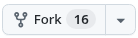
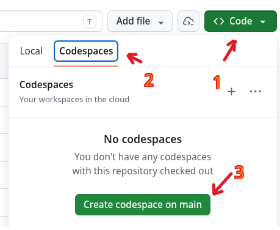

# 🧬 Інструкція з роботи з лабораторними роботами (GitHub Codespaces)

Вітаємо на курсі! Усі лабораторні роботи ми виконуватимемо у хмарному середовищі **GitHub Codespaces**. Це означає, що вам не потрібно нічого встановлювати на свій комп'ютер — усе працюватиме прямо у браузері.

Нижче наведено покрокові інструкції для всіх етапів нашої роботи.

---

## 📍 Етап 1. Перший запуск (Виконується ОДИН раз на початку курсу)

Щоб почати роботу, вам потрібно скопіювати матеріали курсу до свого особистого кабінету GitHub та запустити віртуальний комп'ютер.

1.  **Увійдіть у свій акаунт GitHub** у браузері.
2.  **Зробіть копію (Fork) репозиторію:**
    *   Перейдіть за посиланням на цей репозиторій, яке дав викладач.
    *   У правому верхньому кутку сторінки знайдіть і натисніть кнопку **Fork** .
    *   На сторінці, що відкриється, просто натисніть зелену кнопку **Create fork** внизу. Тепер у вас з'явилася власна копія курсу.
3.  **Запустіть робоче середовище (Codespace):**
    *   На сторінці вашої копії репозиторію натисніть велику зелену кнопку **Code**.
    *   Перейдіть на вкладку **Codespaces**.
    *   Натисніть кнопку **Create codespace on main**.
    
4.  **Зачекайте 1–2 хвилини.** GitHub створює для вас віртуальний комп'ютер та автоматично встановлює Python, програму VS Code та всі біологічні й математичні бібліотеки, які нам знадобляться.

---

## 📝 Етап 2. Як виконувати лабораторну роботу

Коли перед вами відкриється інтерфейс програми (VS Code у браузері), ви готові кодити.

1.  **Відкрийте файл завдання:**
    *   У лівій панелі (провіднику файлів) знайдіть папку з поточною роботою та двічі натисніть на файл із розширенням `.ipynb` (наприклад, `lab01.ipynb`).
2.  **Оберіть середовище запуску (Ядро/Kernel):**
    *   Якщо у правому верхньому кутку записника ви бачите напис **Select Kernel**, натисніть на нього.
    *   Оберіть пункт **Python Environments...**, а потім оберіть запропоновану версію Python (наприклад, Python 3.11).
3.  **Виконання та перевірка:**
    *   Читайте текст та виконуйте комірки з кодом по черзі, натискаючи кнопку **Play (Запуск)** ліворуч від кожної комірки.
    *   У курсі вбудовано автоматичну перевірку **Otter-Grader**. Коли ви запускаєте комірку з кодом на кшталт `grader.check("q1")`, система одразу напише вам, чи правильно ви розв'язали задачу.
4.  **Збереження роботи (Надзвичайно важливо!):**
    *   Коли ви завершили роботу, у самому кінці записника виконайте комірку з командою `grader.export()`. Вона згенерує для вас підсумковий файл.
    *   Перейдіть на ліву панель у вкладку **Source Control** (іконка з трьома точками та лініями) `[Див. Малюнок: Іконка Source Control]`.
    *   У полі **Message** напишіть, що зроблено (наприклад: `виконано lab01`).
    *   Натисніть синю кнопку **Commit**, а потім кнопку **Sync Changes** (або _Push_), щоб ваш викладач міг побачити вашу роботу на сайті GitHub.

---

## ⏳ Етап 3. Правильне закриття роботи та економія безкоштовного часу

У вас є **120 безкоштовних годин** роботи комп'ютера на місяць. Щоб вони не закінчилися завчасно, навчіться правильно вимикати середовище.

1.  **Налаштуйте автоматичне вимкнення (idle timeout):**
    *   Перейдіть за посиланням [://github.com](https://://github.com).
    *   Знайдіть пункт **Default idle timeout** (Час бездіяльності за замовчуванням).
    *   Встановіть значення **10** або **15** хвилин. Тепер, якщо ви відійдете від комп'ютера або просто закриєте вкладку, ваш віртуальний комп'ютер сам вимкнеться через 15 хвилин і не витрачатиме ваші години.
2.  **Як правильно закрити Codespace вручну:**
    *   Не залишайте вкладку просто відкритою. Коли ви закінчили роботу на сьогодні й зберегли код (зробили Commit), натисніть на кнопку меню (три горизонтальні лінії у верхньому лівому кутку VS Code) ➡️ **File** ➡️ **Close Remote Connection**.
    *   Комп'ютер миттєво вимкнеться.

---

## 🔄 Етап 4. Наступна пара: Як відкрити роботу знову та отримати нові завдання

Вам **НЕ ПОТРІБНО** створювати новий Codespace чи знову робити Fork на кожній парі! Ви користуватиметеся одним і тим самим середовищем увесь семестр.

### Випадок А. Ви просто продовжуєте роботу:

1.  Перейдіть на сторінку [://github.com](https://://github.com).
2.  У списку ваших комп'ютерів знайдіть свій Codespace для цього курсу та натисніть на його назву. Він увімкнеться за пару секунд із усіма вашими збереженими файлами та плагінами.

### Випадок Б. Викладач додав нову лабораторну (наприклад, `lab02.ipynb`), і її треба отримати:

1.  Зайдіть на GitHub на сторінку **вашої особистої копії** репозиторію.
2.  Під зеленою кнопкою Code знайдіть рядок із кнопкою **Sync fork** `[Див. Малюнок: Кнопка Sync fork]`. Натисніть її, а потім оберіть **Update branch**. Це підтягне нові файли від викладача у ваш акаунт.
3.  Відкрийте свій Codespace через сайт [://github.com](https://://github.com).
4.  У нижній частині програми VS Code відкрийте вкладку **Terminal** (Термінал) і введіть команду:Натисніть Enter. Нова лабораторна робота з'явиться у вашому списку файлів ліворуч!

### Випадок В. Викладач попросив встановити нову бібліотеку:

Якщо в процесі навчання нам знадобиться нова бібліотека, викладач оновить файл налаштувань. Вам потрібно буде лише:

1.  Оновити репозиторій (як описано у Випадку Б вище).
2.  У терміналі (Terminal) всередині Codespace ввести команду:Натиснути Enter і зачекати 20 секунд. Нові інструменти готові до роботи!

```
pip install -r .devcontainer/requirements.txt
```

```
git pull
```